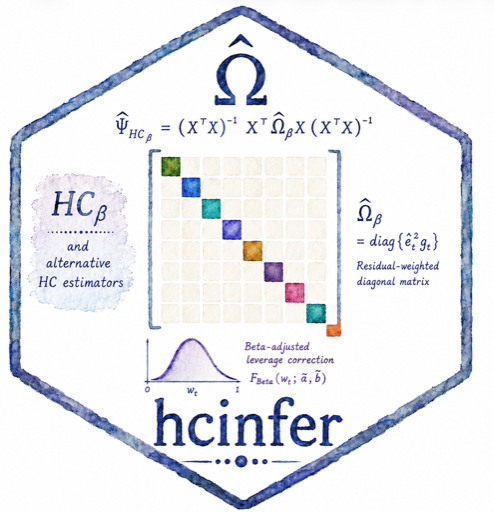

```{r, include = FALSE}
knitr::opts_chunk$set(
  collapse = TRUE,
  comment = "#>",
  fig.path = "man/figures/README-"
)
options(hcinfer.use_emoji = FALSE)
```

# hcinfer 

`hcinfer` computes heteroskedasticity-consistent covariance estimators
and normal Wald inference for ordinary least squares models. It implements
HC0, HC1, HC2, HC3, HC4, HC4m, HC5, HC5m, and HCbeta.

## Installation

```{r, eval = FALSE}
# install.packages("hcinfer")

# Development version
remotes::install_github("prdm0/hcinfer")
```

## Basic Use

```{r}
library(hcinfer)

schools <- PublicSchools
schools$income_scaled <- schools$income / 10000
schools$income_scaled_sq <- schools$income_scaled^2

fit <- lm(expenditure ~ income_scaled + income_scaled_sq, data = schools)

result <- hcinfer(fit)
```

The default estimator is HCbeta. Use `tests()` and `confint()` to extract
the main inferential quantities as tibbles.

```{r}
tests(result)
confint(result)
```

## Confidence Intervals

The `plot()` method displays the robust confidence intervals and marks the
null value used in the tests.

```{r, fig.width = 7, fig.height = 4.5, fig.alt = "Robust confidence intervals for the public-schools regression coefficients."}
plot(result)
```

## Diagnostics

Use `vcov_hc()` when you only need the robust covariance matrix and its
diagnostics. The `plot()` method for this object shows leverage values and
HC adjustment factors.

```{r, fig.width = 7, fig.height = 4.5, fig.alt = "HCbeta adjustment factors plotted against leverage values for the public-schools regression."}
cov_hcbeta <- vcov_hc(fit)
plot(cov_hcbeta)
```

## Main Functions

```{r, eval = FALSE}
hc_methods()
coef(result)
vcov(result)
```

The most common workflow is:

```{r, eval = FALSE}
fit <- lm(y ~ x1 + x2, data = data)
result <- hcinfer(fit, type = "hcbeta")

summary(result)
tests(result)
confint(result)
plot(result)
```

## Learn More

Start with `vignette("introduction", package = "hcinfer")` for a compact
overview of the package API.

## References

- White, H. (1980). A heteroskedasticity-consistent covariance matrix
  estimator and a direct test for heteroskedasticity. *Econometrica*, 48(4),
  817-838.
- Cribari-Neto, F. (2004). Asymptotic inference under heteroskedasticity of
  unknown form. *Computational Statistics and Data Analysis*, 45(2), 215-233.
- Marinho, P. R. D., Cribari-Neto, F., and Cunha, M. O. (2025). HCbeta: A
  beta-distribution-based heteroskedasticity-consistent covariance estimator.
  Working paper.
