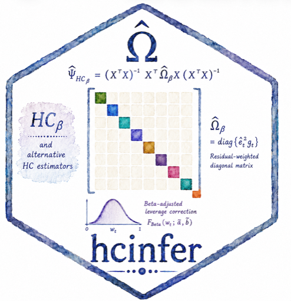

```{r, include = FALSE}
knitr::opts_chunk$set(
  collapse = TRUE,
  comment = "#>",
  dev = "ragg_png",
  dpi = 96,
  fig.retina = 3,
  fig.path = "man/figures/README-"
)
options(hcinfer.use_emoji = FALSE)
```

# hcinfer 

<!-- badges: start -->
[](https://github.com/prdm0/hcinfer/actions/workflows/R-CMD-check.yaml)
[](https://github.com/prdm0/hcinfer/blob/main/LICENSE.md)
[](https://prdm0.github.io/hcinfer/)
[](https://prdm0.r-universe.dev)
[](https://github.com/prdm0/hcinfer/releases)
[](https://www.r-project.org/)
[](https://lifecycle.r-lib.org/articles/stages.html#experimental)
<!-- badges: end -->

`hcinfer` computes heteroskedasticity-consistent covariance estimators
and normal Wald inference for ordinary least squares models. The currently
implemented covariance matrix estimators are listed below.

## Implemented Estimators

The table below is generated by `hc_methods()` and lists the covariance matrix
estimators currently implemented in `hcinfer`.

```{r implemented-estimators, echo = FALSE}
knitr::kable(hcinfer::hc_methods())
```

## Installation

```{r, eval = FALSE}
# Official CRAN installation of the package
install.packages("hcinfer")

# r-universe installation
install.packages('hcinfer', repos = c('https://prdm0.r-universe.dev', 'https://cloud.r-project.org'))

# Development version installation from GitHub
remotes::install_github("prdm0/hcinfer", force = TRUE)
```

## Basic Use

```{r}
library(hcinfer)

schools <- PublicSchools
schools$income_scaled <- schools$income / 10000
schools$income_scaled_sq <- schools$income_scaled^2

fit <- lm(expenditure ~ income_scaled + income_scaled_sq, data = schools)

result <- hcinfer(fit)
```

The default estimator is HCbeta. Use `tests()` and `confint()` to extract
the main inferential quantities as tibbles.

```{r}
tests(result)
confint(result)
```

## Confidence Intervals

The `plot()` method displays the robust confidence intervals and marks the
null value used in the tests.

```{r, fig.width = 7, fig.height = 4.5, fig.alt = "Robust confidence intervals for the public-schools regression coefficients."}
plot(result)
```

## Diagnostics

Use `vcov_hc()` when you only need the robust covariance matrix and its
diagnostics. The `plot()` method for this object shows leverage values and
HC adjustment factors.

```{r, fig.width = 7, fig.height = 4.5, fig.alt = "HCbeta adjustment factors plotted against leverage values for the public-schools regression."}
cov_hcbeta <- vcov_hc(fit)
plot(cov_hcbeta)
```

## Main Functions

```{r, eval = FALSE}
hc_methods()
coef(result)
vcov(result)
```

The most common workflow is:

```{r, eval = FALSE}
fit <- lm(y ~ x1 + x2, data = data)
result <- hcinfer(fit, type = "hcbeta")

summary(result)
tests(result)
confint(result)
plot(result)
```

## Learn More

Start with `vignette("introduction", package = "hcinfer")` for a compact
overview of the package API.

## References

- White, H. (1980). A heteroskedasticity-consistent covariance matrix
  estimator and a direct test for heteroskedasticity. *Econometrica*, 48(4),
  817-838. [doi:10.2307/1912934](https://doi.org/10.2307/1912934).
- Hinkley, D. V. (1977). Jackknifing in unbalanced situations.
  *Technometrics*, 19(3), 285-292.
  [doi:10.1080/00401706.1977.10489550](https://doi.org/10.1080/00401706.1977.10489550).
- MacKinnon, J. G. and White, H. (1985). Some
  heteroskedasticity-consistent covariance matrix estimators with improved
  finite sample properties. *Journal of Econometrics*, 29(3), 305-325.
  [doi:10.1016/0304-4076(85)90158-7](https://doi.org/10.1016/0304-4076(85)90158-7).
- Davidson, R. and MacKinnon, J. G. (1993). *Estimation and Inference in
  Econometrics*. Oxford University Press.
- Cribari-Neto, F. (2004). Asymptotic inference under heteroskedasticity of
  unknown form. *Computational Statistics and Data Analysis*, 45(2), 215-233.
  [doi:10.1016/S0167-9473(02)00366-3](https://doi.org/10.1016/S0167-9473(02)00366-3).
- Cribari-Neto, F. and da Silva, W. B. (2011). A new
  heteroskedasticity-consistent covariance matrix estimator for the linear
  regression model. *AStA Advances in Statistical Analysis*, 95(2), 129-146.
  [doi:10.1007/s10182-010-0141-2](https://doi.org/10.1007/s10182-010-0141-2).
- Cribari-Neto, F., Souza, T. C., and Vasconcellos, K. L. P. (2007).
  Inference under heteroskedasticity and leveraged data. *Communications in
  Statistics - Theory and Methods*, 36(10), 1877-1888.
  [doi:10.1080/03610920601126589](https://doi.org/10.1080/03610920601126589).
- Li, S., Zhang, N., Zhang, X., and Wang, G. (2016). A new
  heteroskedasticity-consistent covariance matrix estimator and inference
  under heteroskedasticity. *Journal of Statistical Computation and
  Simulation*, 87(1), 198-210.
  [doi:10.1080/00949655.2016.1198906](https://doi.org/10.1080/00949655.2016.1198906).
- Cunha, M. A., Cribari-Neto, F., and Marinho, P. R. D. (manuscript). A
  beta-based heteroskedasticity-consistent covariance matrix estimator.
