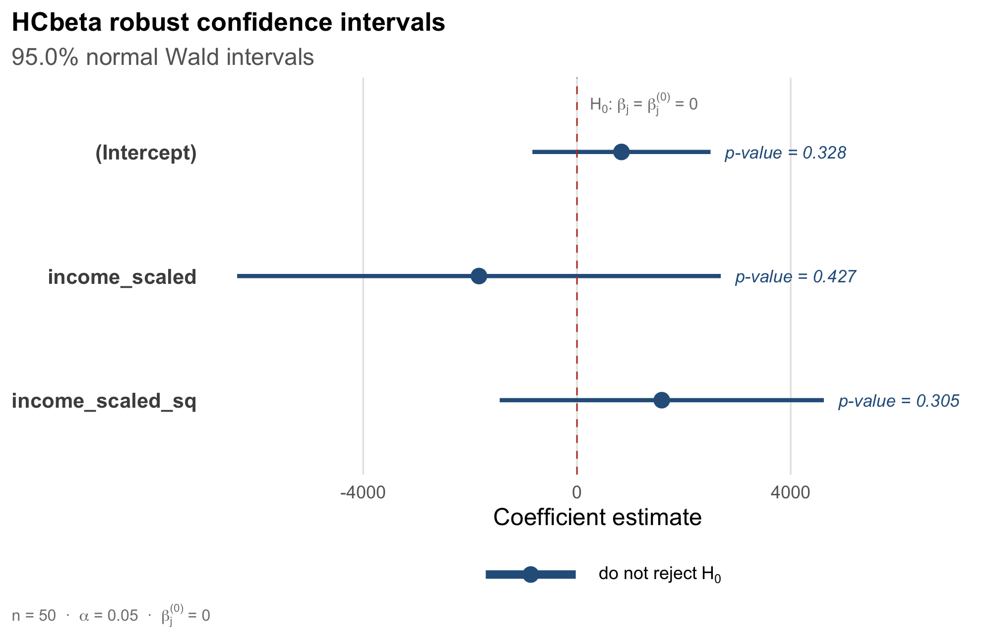
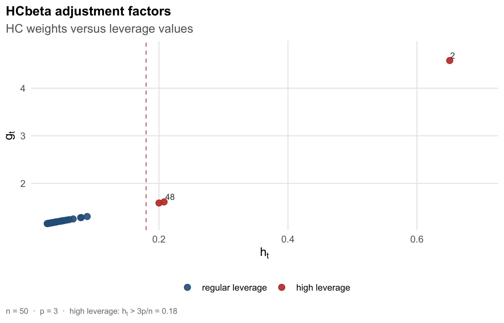

# hcinfer 

<!-- badges: start -->

[](https://github.com/prdm0/hcinfer/actions/workflows/R-CMD-check.yaml)
[](https://github.com/prdm0/hcinfer/blob/main/LICENSE.md)
[](https://prdm0.github.io/hcinfer/)
[](https://prdm0.r-universe.dev)
[](https://github.com/prdm0/hcinfer/releases)
[](https://www.r-project.org/)
[](https://lifecycle.r-lib.org/articles/stages.html#experimental)
<!-- badges: end -->

`hcinfer` computes heteroskedasticity-consistent covariance estimators
and normal Wald inference for ordinary least squares models. The
currently implemented covariance matrix estimators are listed below.

## Implemented estimators

The table below is generated by `hc_methods()` and lists the covariance
matrix estimators currently implemented in `hcinfer`.

| type | label | description | default_arguments |
|:---|:---|:---|:---|
| hc0 | HC0 | White heteroskedasticity-consistent estimator. | none |
| hc1 | HC1 | HC0 with degrees-of-freedom scaling. | none |
| hc2 | HC2 | Leverage-adjusted estimator with exponent 1. | none |
| hc3 | HC3 | Leverage-adjusted estimator with exponent 2. | none |
| hc4 | HC4 | Adaptive leverage correction by Cribari-Neto. | none |
| hc4m | HC4m | Modified HC4 correction by Cribari-Neto and da Silva. | none |
| hc5 | HC5 | High-leverage correction by Cribari-Neto, Souza, and Vasconcellos. | k = 0.7 |
| hc5m | HC5m | Modified HC5 correction by Li, Zhang, Zhang, and Wang. | k = 0.7, k1 = 1, k2 = 0, k3 = 1, gamma1 = 1, gamma2 = 1.5 |
| hcbeta | HCbeta | Beta-distribution leverage correction. | c1 = 7, c2 = 0.75, lower = 0.01, upper = 0.99, a_max = 10000, b_max = 10000 |

## Installation

``` r
# Official CRAN installation of the package
install.packages("hcinfer")

# r-universe installation
install.packages('hcinfer', repos = c('https://prdm0.r-universe.dev', 'https://cloud.r-project.org'))

# Development version installation from GitHub
remotes::install_github("prdm0/hcinfer", force = TRUE)
```

## Basic use

``` r
library(hcinfer)

schools <- PublicSchools
schools$income_scaled <- schools$income / 10000
schools$income_scaled_sq <- schools$income_scaled^2

fit <- lm(expenditure ~ income_scaled + income_scaled_sq, data = schools)

result <- hcinfer(fit)
```

The default estimator is HCbeta. Use `tests()` and `confint()` to
extract the main inferential quantities as tibbles.

HCbeta exposes six tuning controls (`c1`, `c2`, `lower`, `upper`,
`a_max`, `b_max`); see
`vignette("hcinfer-hcbeta", package = "hcinfer")`.

``` r
tests(result)
#> # A tibble: 3 × 8
#>   term             estimate null_value std_error z_value p_value alpha reject
#>   <chr>               <dbl>      <dbl>     <dbl>   <dbl>   <dbl> <dbl> <lgl> 
#> 1 (Intercept)          833.          0      851.   0.979   0.328  0.05 FALSE 
#> 2 income_scaled      -1834.          0     2309.  -0.794   0.427  0.05 FALSE 
#> 3 income_scaled_sq    1587.          0     1547.   1.03    0.305  0.05 FALSE
confint(result)
#> # A tibble: 3 × 4
#>   term             conf_low conf_high level
#>   <chr>               <dbl>     <dbl> <dbl>
#> 1 (Intercept)         -834.     2500.  0.95
#> 2 income_scaled      -6359.     2691.  0.95
#> 3 income_scaled_sq   -1446.     4620.  0.95
```

## Confidence intervals

The `plot()` method displays the robust confidence intervals and marks
the null value used in the tests.

``` r
plot(result)
```



## Diagnostics

Use `vcov_hc()` when you only need the robust covariance matrix and its
diagnostics. The `plot()` method for this object shows leverage values
and HC adjustment factors.

``` r
cov_hcbeta <- vcov_hc(fit)
plot(cov_hcbeta)
```



## Learn more

The package documentation is organized as a progressive learning path.
`vignette("introduction", package = "hcinfer")` covers the API and a
typical workflow. `vignette("hcinfer-hcbeta", package = "hcinfer")`
dives into the HCbeta estimator: its parameters, diagnostics, and
sensitivity controls.
`vignette("hcinfer-methodology", package = "hcinfer")` presents the
statistical methodology behind all HC estimators and the HCbeta
motivation. `vignette("hcinfer-comparison", package = "hcinfer")`
compares HCbeta with classical HC estimators on real data. Finally,
`vignette("hcinfer-bootstrap", package = "hcinfer")` describes the
bootstrap companion for resampling-based inference.

## References

- White, H. (1980). A heteroskedasticity-consistent covariance matrix
  estimator and a direct test for heteroskedasticity. *Econometrica*,
  48(4), 817-838.
  [doi:10.2307/1912934](https://doi.org/10.2307/1912934).
- Cribari-Neto, F. (2004). Asymptotic inference under heteroskedasticity
  of unknown form. *Computational Statistics and Data Analysis*, 45(2),
  215-233.
  [doi:10.1016/S0167-9473(02)00366-3](https://doi.org/10.1016/S0167-9473(02)00366-3).
- Cribari-Neto, F. and da Silva, W. B. (2011). A new
  heteroskedasticity-consistent covariance matrix estimator for the
  linear regression model. *AStA Advances in Statistical Analysis*,
  95(2), 129-146.
  [doi:10.1007/s10182-010-0141-2](https://doi.org/10.1007/s10182-010-0141-2).
- Cunha, M. A., Cribari-Neto, F., and Marinho, P. R. D. (manuscript). A
  beta-based heteroskedasticity-consistent covariance matrix estimator.

See `vignette("hcinfer-methodology", package = "hcinfer")` for the
complete reference list.
